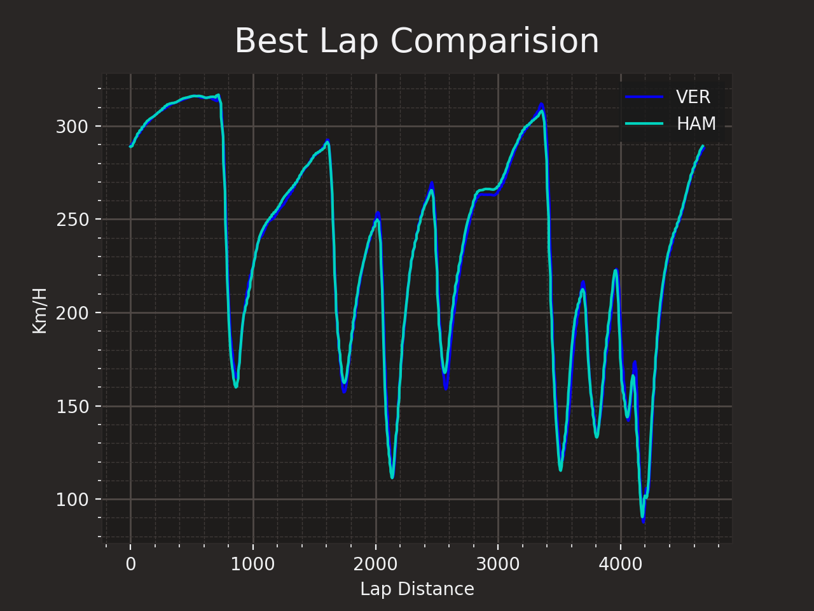

# Formula-Data
A tool to anaylize formula 1 data made in python 

This tool is being made in order to learn how to procces and analyise data related to F1

# packages needed
In order to use Formula data you will need to install the fastF1 package, This is where The data of the cars comes from. You can check his github page with the following link:
https://github.com/theOehrly/Fast-F1

This tool is still being developed.
So far the following functionalities are implemented:
Compare fastest laps between a list of drivers.
Compare the delta between multiples laps of a list of drivers.

## USAGE
the tool can't be used yet but this are some screenshots of some functionalities.

_Fastest lap Quali comparison between verstappen and hamilton In Barcelona_

